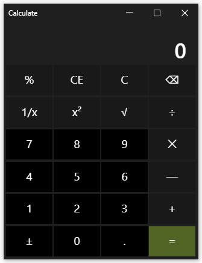

# Calculator with ElectronJS and TypeScript 🧮

<div align="center">
  
</div>

## Description

A modern desktop calculator application built with ElectronJS and TypeScript. This project demonstrates the integration of web technologies for creating cross-platform desktop applications.

## Features

- Cross-platform desktop application
- Modern TypeScript implementation
- Clean and intuitive user interface
- Basic calculator operations
- Built with ElectronJS for native desktop experience

## Prerequisites

- Node.js (v14 or higher) - [Download Node.js](https://nodejs.org/en/)
- npm (comes with Node.js)

## Installation

1. Clone the repository:
```bash
git clone https://github.com/Progovich/electron-ts-nodejs-calculator.git
cd electron-ts-nodejs-calculator
```

2. Install dependencies:
```bash
npm install
```

## Running the Application

To start the calculator, run:
```bash
npm run start
```

## Development

The project uses:
- ElectronJS for the desktop application framework
- TypeScript for type-safe JavaScript
- Node.js as the runtime environment

## License

This project is open source and available under the MIT License.

---

# Калькулятор на ElectronJS и TypeScript 🧮

<div align="center">
  
</div>

## Описание

Десктопное приложение-калькулятор, разработанное с использованием ElectronJS и TypeScript. Проект демонстрирует интеграцию веб-технологий для создания кроссплатформенных десктопных приложений.

## Возможности

- Кроссплатформенное десктопное приложение
- Современная реализация на TypeScript
- Чистый и интуитивно понятный интерфейс
- Базовые операции калькулятора
- Создано с помощью ElectronJS для нативного десктопного опыта

## Требования

- Node.js (v14 или выше) - [Скачать Node.js](https://nodejs.org/en/)
- npm (поставляется с Node.js)

## Установка

1. Клонируйте репозиторий:
```bash
git clone https://github.com/Progovich/electron-ts-nodejs-calculator.git
cd electron-ts-nodejs-calculator
```

2. Установите зависимости:
```bash
npm install
```

## Запуск приложения

Для запуска калькулятора выполните:
```bash
npm run start
```

## Разработка

Проект использует:
- ElectronJS как фреймворк для десктопного приложения
- TypeScript для типобезопасного JavaScript
- Node.js как среда выполнения

## Лицензия

Этот проект с открытым исходным кодом и доступен под лицензией MIT.

